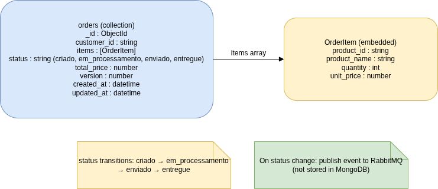

## Serviço de Gerenciamento de Pedidos (Order Service)

Microsserviço em Go para gerenciamento de pedidos de e-commerce, seguindo arquitetura hexagonal e arquitetura limpa, com MongoDB, RabbitMQ, Gin, testes (unitários, integração e end-to-end), documentação Swagger.



### Stack utilizada

- **Linguagem**: Go 1.26.1
- **HTTP**: Gin
- **Banco de dados**: MongoDB
- **Mensageria**: RabbitMQ (AMQP)
- **Logger**: Zap
- **Configuração**: Cleanenv
- **Testes**: Testify, Dockertest
- **Docs API**: Swag + gin-swagger
- **Containerização**: Docker + Docker Compose

### Instruções de execução

- Copie `.env.example` para `.env` e ajuste os valores se necessário.
- Suba toda a stack (app + MongoDB + RabbitMQ) com:

```bash
docker-compose up --build -d
```

ou

```bash
make docker-up
```

- Derrubar a stack:

```bash
make docker-down
```

- Desenvolvimento com hot-reload (requer `air` instalado via `go tool`):

```bash
make dev
```
> Caso executar aplicação fora do container, mas que já tenha o banco e a fila configurados

- Executar a aplicação sem hot-reload:

```bash
make run
```
> Caso executar aplicação fora do container, mas que já tenha o banco e a fila configurados

### Variáveis de ambiente

| Variável                 | Obrigatória | Default      | Descrição                              |
|--------------------------|------------|--------------|----------------------------------------|
| `APP_PORT`              | Não        | `8080`       | Porta HTTP da aplicação                |
| `APP_ENV`               | Não        | `development`| Ambiente (`development` \| `production`)| 
| `APP_READ_TIMEOUT_SECONDS`  | Não    | `15`         | Timeout de leitura HTTP (segundos)     |
| `APP_WRITE_TIMEOUT_SECONDS` | Não    | `15`         | Timeout de escrita HTTP (segundos)     |
| `APP_IDLE_TIMEOUT_SECONDS`  | Não    | `60`         | Timeout de conexões ociosas HTTP (segundos) |
| `MONGODB_URI`           | **Sim**    | —            | URI de conexão do MongoDB             |
| `MONGODB_DATABASE`      | **Sim**    | —            | Nome do database do MongoDB           |
| `MONGODB_TIMEOUT_SECONDS` | Não      | `10`         | Timeout (segundos) para operações Mongo|
| `MONGODB_MAX_POOL_SIZE`   | Não      | `0`          | Tamanho máximo do pool de conexões MongoDB (0 = default do driver) |
| `MONGODB_MIN_POOL_SIZE`   | Não      | `0`          | Tamanho mínimo do pool de conexões MongoDB (0 = default do driver) |
| `MONGODB_MAX_CONN_IDLE_TIME_SECONDS` | Não | `0` | Tempo máximo de ociosidade de uma conexão no pool (0 = default do driver) |
| `RABBITMQ_URI`          | **Sim**    | —            | URI de conexão do RabbitMQ            |
| `RABBITMQ_EXCHANGE`     | Não        | `orders`     | Nome do exchange para eventos de pedido|
| `RABBITMQ_QUEUE`        | **Sim**    | —            | Nome da fila de eventos de status     |
| `RABBITMQ_ROUTING_KEY`  | **Sim**    | —            | Routing key para eventos de status    |
| `LOGGER_LEVEL`          | Não        | `debug`      | Nível de log (`debug`, `info`, etc.)  |

### Comandos principais (Makefile)

- **Rodar aplicação**: `make run`
- **Rodar em desenvolvimento (hot reload)**: `make dev`
- **Build do binário**: `make build`
- **Testes + cobertura (domínio, aplicação, adapters)**: `make test`
- **Cobertura (resumo no terminal)**: `make coverage`
- **Cobertura em HTML (`coverage.html`)**: `make coverage-html`
- **Gerar documentação Swagger**: `make swagger`
- **Subir stack com Docker Compose**: `make docker-up`
- **Derrubar stack**: `make docker-down`

### Endpoints principais

- `POST /orders` – cria pedido
- `GET /orders/:id` – consulta pedido por ID
- `PATCH /orders/:id/status` – atualiza status do pedido (publica evento no RabbitMQ). Aceita qualquer transição entre os status válidos (`criado`, `em_processamento`, `enviado`, `entregue`), mas rejeita tentativas de atualizar para o mesmo status atual.
- `GET /health` – healthcheck
- `GET /swagger/index.html` – Swagger UI
- Arquivo `api.http` na raiz do projeto com exemplos de requisições HTTP para testar os endpoints (pode ser usado em IDEs).

### Testes e cobertura

- **Unitários**:
  - Camadas `internal/domain` e `internal/application`.
  - Casos: criação de pedido, validações, transições de status, erros de repositório/publisher.
- **Integração**:
  - Pasta `tests/` com suites usando Dockertest para:
    - MongoDB (`order_repository_integration_test.go`)
    - RabbitMQ (`publisher_integration_test.go`)
    - Fluxo end-to-end HTTP → MongoDB → RabbitMQ (`e2e_test.go`)
- **Cobertura**:
  - Rodar todos os testes com cobertura focada em domínio, aplicação e adapters:

```bash
make test
```

  Ou, sem Make:

```bash
go test ./... -coverpkg=./internal/domain/...,./internal/application/...,./internal/adapters/... -coverprofile=coverage.out
```

  - Ver resumo de cobertura por função no terminal:

```bash
make coverage
```

  Ou, sem Make (execute `make test` ou o comando acima antes, para gerar `coverage.out`):

```bash
go tool cover -func=coverage.out
```

  **Resultado da cobertura** (saída de `make coverage` — pacotes e resumo por função):

  - Pacotes considerados na cobertura: `internal/domain/...`, `internal/application/...`, `internal/adapters/...`.
  - Exemplo de saída atual no terminal (resumo por função e total, via `make coverage`):

```
order-service/internal/adapters/http/dto/request.go:21:		ToDomainItems		100.0%
order-service/internal/adapters/http/dto/response.go:35:	FromDomain		100.0%
order-service/internal/adapters/http/handler.go:21:		NewHandler		100.0%
order-service/internal/adapters/http/handler.go:32:		Health			100.0%
order-service/internal/adapters/http/handler.go:56:		CreateOrder		100.0%
order-service/internal/adapters/http/handler.go:83:		GetOrder		100.0%
order-service/internal/adapters/http/handler.go:110:		UpdateOrderStatus	100.0%
order-service/internal/adapters/http/middleware.go:12:		RequestLogger		100.0%
order-service/internal/adapters/http/middleware.go:35:		generateTraceID		100.0%
order-service/internal/adapters/http/router.go:12:		NewRouter		100.0%
order-service/internal/adapters/mongodb/order_repository.go:21:	NewOrderRepository	100.0%
order-service/internal/adapters/mongodb/order_repository.go:27:	Create			83.3%
order-service/internal/adapters/mongodb/order_repository.go:39:	GetByID			77.8%
order-service/internal/adapters/mongodb/order_repository.go:56:	Update			80.0%
order-service/internal/adapters/rabbitmq/publisher.go:24:	NewPublisher		45.0%
order-service/internal/adapters/rabbitmq/publisher.go:83:	PublishStatusChanged	62.5%
order-service/internal/adapters/rabbitmq/publisher.go:107:	Close			50.0%
order-service/internal/application/order/service.go:18:		NewService		100.0%
order-service/internal/application/order/service.go:25:		CreateOrder		100.0%
order-service/internal/application/order/service.go:42:		GetOrderByID		100.0%
order-service/internal/application/order/service.go:46:		UpdateOrderStatus	100.0%
order-service/internal/domain/order/order.go:27:		NewOrder		100.0%
order-service/internal/domain/order/order.go:64:		CanTransitionTo		100.0%
order-service/internal/domain/order/order.go:72:		UpdateStatus		100.0%
order-service/internal/domain/order/status.go:12:		IsValid			100.0%
total:								(statements)		88.2%
```

  - Gerar relatório HTML em `coverage.html` (meta ≥ 60%):

```bash
make coverage-html
```

  Ou, sem Make:

```bash
go tool cover -html=coverage.out -o coverage.html
```

### Principais decisões técnicas

- **Arquitetura**: hexagonal e arquitetura limpa (Ports & Adapters), com domínio e aplicação independentes de detalhes de infra.
- **Persistência**: MongoDB Driver v2, repositório recebe `*mongo.Database` para facilitar troca de banco e testes.
- **Mensageria**: RabbitMQ com exchange `orders`, routing key `order.status.updated` e evento de mudança de status tipado.
- **Configuração**: `cleanenv` lendo exclusivamente de `.env`, com validação de variáveis obrigatórias.
- **Observabilidade**: logs estruturados com Zap, middleware adicionando `trace_id` e inclusão de `order_id` em operações críticas.
- **Testes**: uso de `testify/mock` para mocks de ports, Dockertest para MongoDB/RabbitMQ e suite e2e exercendo o fluxo completo da API.
- **Uso de `context.Context`**: todos os endpoints HTTP propagam `context.Context` até as camadas de aplicação, repositório e publisher, permitindo controle de timeout/cancelamento, melhorando a resiliência em cenários de lentidão em MongoDB/RabbitMQ e evitando operações “órfãs” após o cliente desistir da requisição.
- **Concorrência em atualização de pedidos**: controle de concorrência **otimista** baseado em campo `version` no documento de pedido. A camada de domínio apenas valida e altera o status; o repositório MongoDB aplica `UpdateOne` com filtro em `(_id, version)` e operação atômica `"$inc": {"version": 1}`. Se nenhum documento for casado, o repositório retorna `ErrConcurrentUpdate`, que o handler HTTP mapeia para `HTTP 409 (Conflict)`, evitando atualizações perdidas quando múltiplas requisições tentam mudar o mesmo pedido simultaneamente. Outras estratégias (como locks pessimistas, filas dedicadas ou uso de transações distribuídas) foram consideradas, mas o lock otimista foi escolhido por ser suficiente para o contexto atual e manter a solução mais simples que atende o problema.